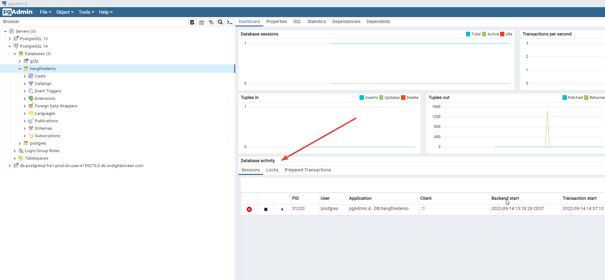
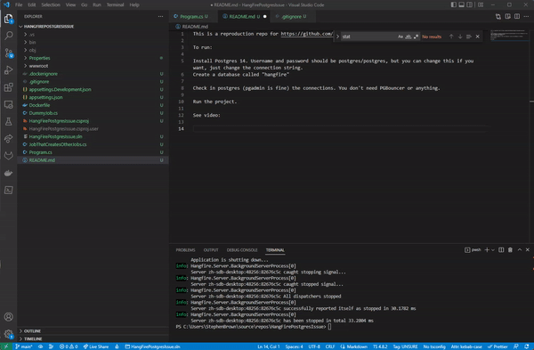

This is a reproduction repo for https://github.com/frankhommers/Hangfire.PostgreSql/issues/163

To run:

Install Postgres 14 (lower is probably fine). 

Create a database called "hangfiredemo"

Check in postgres (pgadmin is fine) the connections. You don't need PGBouncer or anything. You will see no connections (apart from pgadmin)

Run the project.

Check the connections - you'll see a couple.

Either wait, or run the job creator job from the recurring jobs (even click it a few times, to be nasty).  

Go back to pgadmin and view the connections. You'll see that it keeps increasing.

If you then allow the job to run a few more times, the server will stop accepting incoming connections

See video:

